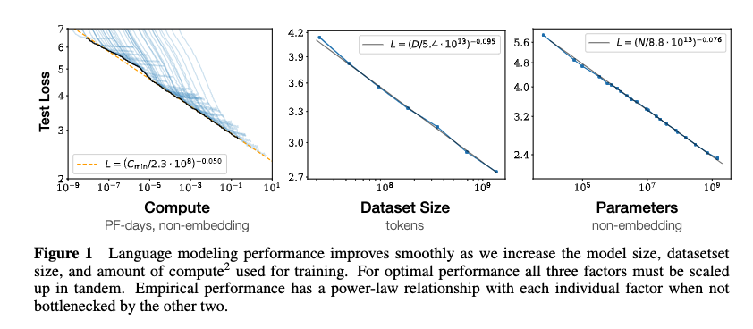
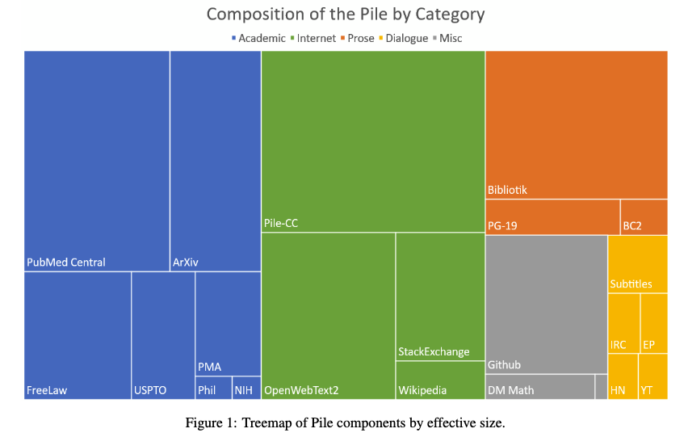
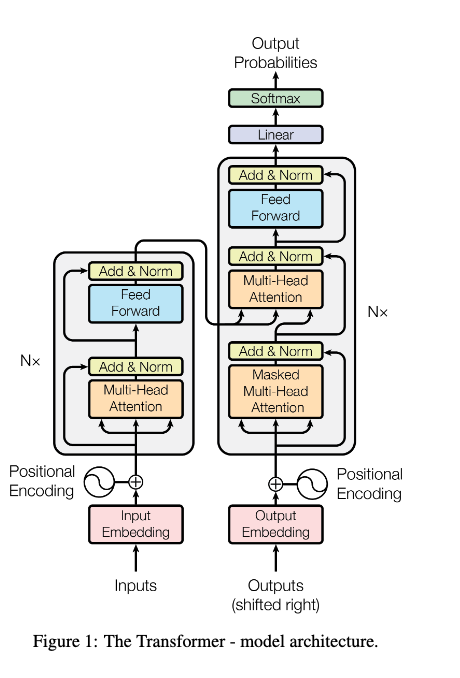
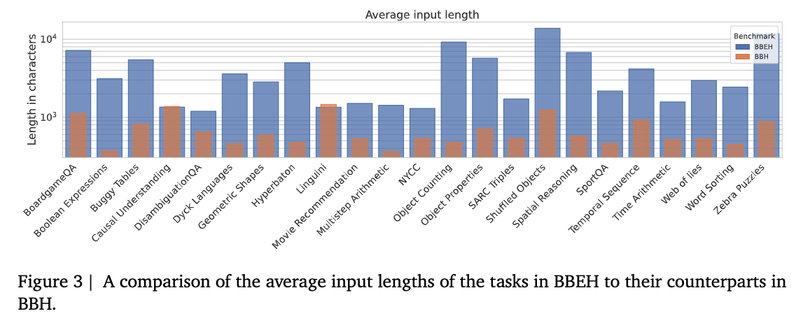

Large Language Models (LLMs) have seen remarkable progress in recent years, transforming the landscape of artificial intelligence and natural language processing. In this post, we break down the technical reasons for this rapid improvement, with explanations and visual aids suitable for CS undergraduates and graduate-level researchers.

## 1. Scaling Laws and Model Size

One of the most important discoveries in modern deep learning is the existence of **scaling laws**. Kaplan et al. (2020) showed that as you increase the number of model parameters, the amount of training data, and the compute budget, the performance of LLMs improves in a predictable, often log-linear fashion. This means that, up to a point, "bigger is better" for language models.

<!--  -->

*Figure: Example scaling curve from [Kaplan et al., 2020](https://arxiv.org/abs/2001.08361).*

This insight led to the creation of models like GPT-3, GPT-4, and Gemini, which have hundreds of billions of parameters. These models can memorize more patterns, capture more nuanced relationships, and generalize better to new tasks.

## 2. Improved Training Data and Curation

The quality and diversity of training data are crucial. Early LLMs were trained on web scrapes with minimal filtering, but modern models use carefully curated datasets that include books, code, scientific papers, and multilingual content. For example, "The Pile" ([Gao et al., 2020](https://arxiv.org/abs/2101.00027)) is an 800GB dataset designed to be both broad and high-quality.

<!--  -->

*Figure: The Pile dataset is a diverse, high-quality resource for LLM training ([Gao et al., 2020](https://arxiv.org/abs/2101.00027)).*

This diversity allows LLMs to answer questions about a wide range of topics, write code, and even reason about scientific problems.

## 3. Advanced Training Techniques

Modern LLMs are not just trained to predict the next word. Techniques like **Reinforcement Learning from Human Feedback (RLHF)** ([Ouyang et al., 2022](https://arxiv.org/abs/2203.02155)) allow models to be fine-tuned based on human preferences, making their outputs more helpful and less toxic. **Instruction tuning** and **chain-of-thought prompting** ([Wei et al., 2022](https://arxiv.org/abs/2201.11903)) further improve the ability of LLMs to follow complex instructions and reason step by step.

*Figure: RLHF pipeline for aligning LLMs with human preferences ([Ouyang et al., 2022](https://arxiv.org/abs/2203.02155)).*

## 4. Architectural Innovations

The **Transformer** architecture ([Vaswani et al., 2017](https://arxiv.org/abs/1706.03762)) is the backbone of all modern LLMs. However, new ideas like **sparse attention** (which reduces compute by focusing only on relevant parts of the input), **mixture-of-experts** ([Shazeer et al., 2017](https://arxiv.org/abs/1701.06538)), and **retrieval-augmented generation** ([Borgeaud et al., 2022](https://arxiv.org/abs/2112.04426)) have made models faster and more efficient.

<!--  -->

*Figure: The Transformer architecture is foundational for LLMs ([Vaswani et al., 2017](https://arxiv.org/abs/1706.03762)).*

## 5. Better Evaluation and Safety Practices

As LLMs become more powerful, evaluating their capabilities and ensuring safety is critical. The community has developed robust benchmarks (e.g., MMLU, BIG-bench) and safety protocols to reduce harmful or biased outputs ([OpenAI, 2023](https://openai.com/research/publications)). This includes adversarial testing, red-teaming, and continuous monitoring.

<!--  -->

*Figure: BIG-bench is a collaborative benchmark for evaluating LLMs ([BIG-bench Extra Hard, Google AI](https://arxiv.org/pdf/2502.19187)).*

## Conclusion

The rapid improvement of LLMs is driven by a combination of scaling, better data, advanced training, architectural innovation, and improved evaluation. Each of these factors is underpinned by technical advances and careful engineering. As research continues, we can expect even more capable and responsible language models in the near future.

---

**References:**
- Kaplan, J., et al. (2020). Scaling Laws for Neural Language Models. [arXiv:2001.08361](https://arxiv.org/abs/2001.08361)
- Gao, L., et al. (2020). The Pile: An 800GB Dataset of Diverse Text for Language Modeling. [arXiv:2101.00027](https://arxiv.org/abs/2101.00027)
- Ouyang, L., et al. (2022). Training language models to follow instructions with human feedback. [arXiv:2203.02155](https://arxiv.org/abs/2203.02155)
- Wei, J., et al. (2022). Chain-of-Thought Prompting Elicits Reasoning in Large Language Models. [arXiv:2201.11903](https://arxiv.org/abs/2201.11903)
- Vaswani, A., et al. (2017). Attention is All You Need. [arXiv:1706.03762](https://arxiv.org/abs/1706.03762)
- Shazeer, N., et al. (2017). Outrageously Large Neural Networks: The Sparsely-Gated Mixture-of-Experts Layer. [arXiv:1701.06538](https://arxiv.org/abs/1701.06538)
- Borgeaud, S., et al. (2022). Improving language models by retrieving from trillions of tokens. [arXiv:2112.04426](https://arxiv.org/abs/2112.04426)
- OpenAI. (2023). Research Publications. [OpenAI](https://openai.com/research/publications)
